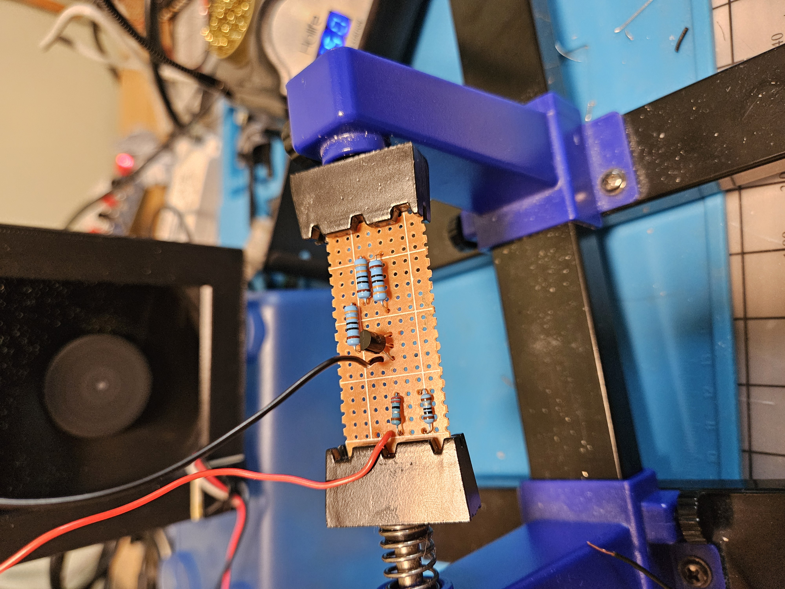

# Bird Box camera

Hosts a web page with a live camera feed from a Pi Zero. It also controlls two IR LEDs to illuminate the bird box from within at night. 
The server is hosted useing flask python library.

# Example Image
Pending until I get back on the home wifi network. There is a bird in there trust me bro.

# Build Images

 
Using transitor to switch large current for each LED:
 

